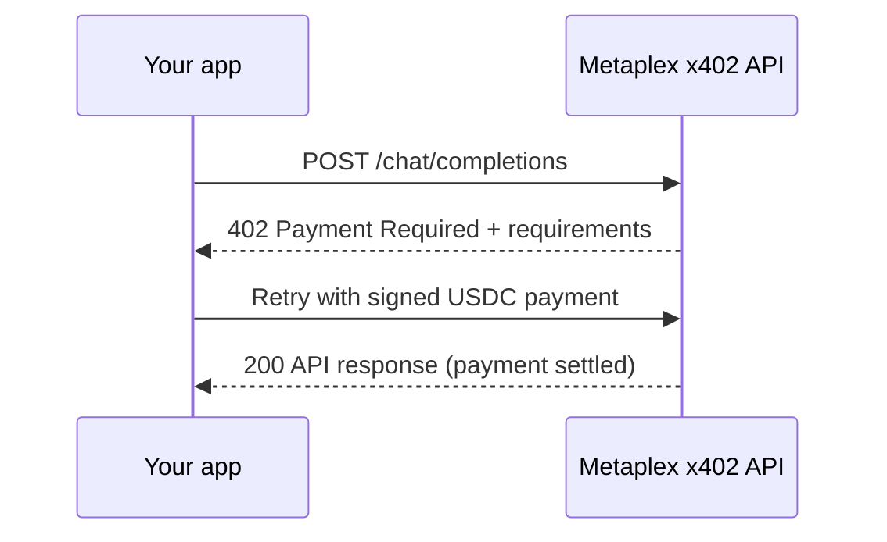

# @metaplex-foundation/x402

[](https://www.npmjs.com/package/@metaplex-foundation/x402)
[](./LICENSE)

Pay-per-request AI and Solana infrastructure over HTTP. No API keys, no
accounts, no subscriptions — bring a USDC-funded Solana wallet, Metaplex Core
asset, or Metaplex Agent, and every request pays for itself.

This package is the TypeScript client for Metaplex's hosted
[x402](https://www.x402.org) services, powered by
[Mech](https://www.metaplex.com/agents/MECHjj31U1hBapoVeJtZo5U5WGRd2293JEwRErvPTuF),
Metaplex's on-chain agent. Payments are made in USDC to Mech's Core wallet —
an agent with its own wallet, selling services to yours:

| Service          | What you get                                                                                          | Works with                 |
| ---------------- | ----------------------------------------------------------------------------------------------------- | -------------------------- |
| AI inference     | OpenAI-compatible chat completions (OpenAI and Anthropic models) and image generation (OpenAI models) | OpenAI SDK, Vercel AI SDK  |
| Solana RPC + DAS | Standard JSON-RPC and Digital Asset Standard reads, priced per request                                | Solana Kit, Solana web3.js |

By using the Metaplex x402 services, you agree to the
[Terms and Conditions](https://www.metaplex.foundation/terms-and-conditions) and
[Privacy Policy](https://www.metaplex.foundation/privacy-policy).

## How it works

x402 turns HTTP's `402 Payment Required` status into a machine-payable flow:

1. Your app calls an endpoint as usual.
2. The server responds `402` with payment requirements (amount, mint, payee).
3. The client signs a USDC payment and retries the request with a payment
   header.
4. The server settles the payment on Solana and returns the API response.



Every integration follows the same shape: **choose a payment mode to build a
payment-aware `fetch`, then hand that `fetch` to whatever client you already
use** — the OpenAI SDK, the Vercel AI SDK, a Solana RPC client, or plain HTTP.

## Quickstart

Zero to a paid chat completion with a standard Solana wallet.

### 1. Install

Requires Node.js 20.18+ and ESM.

```sh
pnpm add @metaplex-foundation/x402 \
  @metaplex-foundation/umi \
  @solana/kit \
  @x402/core \
  @x402/fetch \
  @x402/svm
```

Then add the client you plan to use:

| Client         | Install                                 |
| -------------- | --------------------------------------- |
| OpenAI SDK     | `pnpm add openai`                       |
| Vercel AI SDK  | `pnpm add ai @ai-sdk/openai-compatible` |
| Solana web3.js | `pnpm add @solana/web3.js`              |

### 2. Fund a wallet

Hold USDC in the wallet's token account on the network advertised by the x402
resource server. Standard wallets need no SOL — the service's fee payer covers
the payment transaction's network fee. Never embed a private key in browser
code.

### 3. Make a paid request

```ts
import { METAPLEX_X402_BASE_URL } from '@metaplex-foundation/x402';
import { createKeyPairSignerFromBytes, getBase58Encoder } from '@solana/kit';
import { x402Client } from '@x402/core/client';
import { wrapFetchWithPayment } from '@x402/fetch';
import { ExactSvmScheme } from '@x402/svm/exact/client';
import OpenAI from 'openai';

// A Solana signer whose token account holds USDC.
const svmSigner = await createKeyPairSignerFromBytes(
  getBase58Encoder().encode(process.env.SVM_PRIVATE_KEY!),
);

// An x402 client that pays with that wallet.
const paymentClient = new x402Client();
paymentClient.register('solana:*', new ExactSvmScheme(svmSigner));

// Any HTTP client that accepts a custom fetch now pays per request.
const openai = new OpenAI({
  // The OpenAI SDK requires a value, but this gateway authenticates by payment.
  apiKey: 'x402',
  baseURL: METAPLEX_X402_BASE_URL,
  fetch: wrapFetchWithPayment(fetch, paymentClient),
});

const completion = await openai.chat.completions.create({
  model: 'openai/gpt-5.4-mini',
  messages: [{ role: 'user', content: 'Say hi in one word.' }],
});
```

Payment happens transparently inside the wrapped `fetch`; your code only sees
the final API response. [Discover the available model IDs](#models-and-pricing)
before selecting a model.

## Choose a payment mode

|                 | Standard wallet                       | Core asset or Agent (direct)                                  | Delegated Agent (instant)                      |
| --------------- | ------------------------------------- | ------------------------------------------------------------- | ---------------------------------------------- |
| Funds come from | Your wallet's USDC account            | The asset's own wallet (its signer PDA)                       | The Agent's own wallet (its signer PDA)        |
| Owner signs     | Every payment                         | Every payment                                                 | Once, at delegation                            |
| Setup           | None                                  | Fund the asset's wallet                                       | Register the Agent, then delegate once         |
| Best for        | Apps and scripts paying as themselves | Giving an asset or agent its own budget, with owner oversight | Autonomous agents that pay without supervision |

- **Standard wallet** is plain x402 — the simplest way to pay as yourself.
- **Core asset or Agent (direct)** turns any Metaplex Core asset into a payer.
  Every Core asset has a built-in wallet — its asset signer PDA. Funding that
  wallet keeps spending isolated from your main wallet, and the budget travels
  with the asset if ownership changes. The owner still signs each payment.
- **Delegated Agent (instant)** removes the per-payment signature. Delegate a
  registered Metaplex Agent to Mech once — on-chain and revocable — and the
  server then builds and approves payments from the Agent's wallet. The client
  authenticates with a signed message instead of a transaction signature,
  making this the mode for autonomous agents and high-frequency workloads.

Core asset and Agent payments use Core
[`execute`](https://www.metaplex.com/docs/smart-contracts/core/execute-asset-signing)
under the hood; the SDK's public API names retain that protocol terminology.

### Funding requirements

| Payment mode                              | USDC                                  | SOL                                                |
| ----------------------------------------- | ------------------------------------- | -------------------------------------------------- |
| Standard wallet                           | Wallet's USDC token account           | Not needed                                         |
| Core asset or Agent (direct or delegated) | Asset signer PDA's USDC token account | Required in the signer PDA for Core `execute` fees |

The payment source is always a classic SPL Token associated token account;
Token-2022 payment mints are not currently supported.

### Pay with a standard wallet

Use `ExactSvmScheme` from `@x402/svm`, as shown in the [Quickstart](#quickstart).
This package adds the endpoint constants and discovery helpers; the payment
flow itself is vanilla x402.

```ts
const fetchWithPayment = wrapFetchWithPayment(fetch, paymentClient);
```

### Pay directly with a Core asset or Agent

Use this mode when the asset owner can sign each payment. Register
`MetaplexSvmExactScheme` with a `coreExecute` target: the owner signs, and the
USDC transfer is funded from the asset signer PDA's token account via Core
`execute`.

```ts
import { MetaplexSvmExactScheme } from '@metaplex-foundation/x402';
import { x402Client } from '@x402/core/client';
import { wrapFetchWithPayment } from '@x402/fetch';

const paymentClient = new x402Client();
paymentClient.register(
  'solana:*',
  new MetaplexSvmExactScheme(svmSigner, {
    rpcUrl: svmRpcUrl,
    coreExecute: {
      asset: coreAssetAddress,
    },
  }),
);

const fetchWithPayment = wrapFetchWithPayment(fetch, paymentClient);
```

`svmSigner` is the signer that controls the asset, `svmRpcUrl` is the Solana
RPC endpoint used to build payment transactions, and `coreAssetAddress` is the
Core asset or Agent address. See [scheme options](#metaplexsvmexactscheme-options)
for the full option list, including `coreExecute.collection`, which is required
when the asset belongs to a Core collection.

### Pay instantly with a delegated Agent

Delegate your Agent to Mech once so subsequent payments can be approved
without an owner signature on every request. The Agent must be a registered
Agent Identity owned by the approving signer —
[mint a new agent](https://www.metaplex.com/docs/agents/mint-agent) or
[register an existing Core asset as an agent](https://www.metaplex.com/docs/agents/register-agent)
if needed.

After delegation, the client authenticates with a
Sign-In-With-X message signature and receives a 24-hour bearer token; the
server builds payments from the Agent's wallet. You stay in control: the
delegation is an on-chain grant you can revoke at any time.

#### One-time setup: approve delegation

```ts
import {
  approveMetaplexCoreExecuteDelegate,
  fetchMetaplexCoreExecuteDelegateStatus,
} from '@metaplex-foundation/x402';

const status = await fetchMetaplexCoreExecuteDelegateStatus(coreAssetAddress);

if (!status.isDelegated) {
  await approveMetaplexCoreExecuteDelegate(svmSigner, coreAssetAddress, {
    rpcUrl: svmRpcUrl,
  });
}
```

Call `revokeMetaplexCoreExecuteDelegate` with the same signer, asset, and RPC
options to remove the authority later.

#### Pick an integration style

Reactive and proactive integrations are alternatives — use one, never both:

- **Reactive** — register a client extension; the initial `402` response
  drives authentication and preserves the server's dynamic payment
  requirements. Choose this when you already run an `x402Client` (for example
  alongside other paid services) or want optional fallback to direct payment.
- **Proactive** — wrap `fetch` directly; the client authenticates before the
  resource request, so no `402` round trip is visible. Choose this for the
  simplest wiring against Metaplex endpoints only.

`solanaSigner` below is a message-capable Solana signer for authentication —
a Solana Kit keypair signer works (see the runnable examples).

#### Reactive Agent payment

```ts
import {
  createMetaplexCoreExecuteDelegateClientExtension,
  InMemoryMetaplexCoreExecuteDelegateAuthTokenStore,
  MetaplexSvmExactScheme,
} from '@metaplex-foundation/x402';
import { x402Client } from '@x402/core/client';
import { wrapFetchWithPayment } from '@x402/fetch';

const authTokenStore = new InMemoryMetaplexCoreExecuteDelegateAuthTokenStore();
const paymentClient = new x402Client();

paymentClient.register(
  'solana:*',
  new MetaplexSvmExactScheme(svmSigner, { rpcUrl: svmRpcUrl }),
);
paymentClient.registerExtension(
  createMetaplexCoreExecuteDelegateClientExtension({
    signer: solanaSigner,
    asset: coreAssetAddress,
    authTokenStore,
  }),
);

const fetchWithPayment = wrapFetchWithPayment(fetch, paymentClient);
```

#### Proactive Agent payment

```ts
import {
  InMemoryMetaplexCoreExecuteDelegateAuthTokenStore,
  wrapFetchWithMetaplexCoreExecuteDelegate,
} from '@metaplex-foundation/x402';

const authTokenStore = new InMemoryMetaplexCoreExecuteDelegateAuthTokenStore();

const fetchWithPayment = wrapFetchWithMetaplexCoreExecuteDelegate(fetch, {
  signer: solanaSigner,
  asset: coreAssetAddress,
  authTokenStore,
});
```

Delegation approval is still required; requests to other origins pass through
untouched.

#### Auth tokens, fallback, and events

- Authorization JWTs expire after 24 hours. Expired tokens are discarded and
  replaced automatically — replacement requires a message signature, not
  another on-chain delegation approval.
- Use `InMemoryMetaplexCoreExecuteDelegateAuthTokenStore` in Node.js and
  `LocalStorageMetaplexCoreExecuteDelegateAuthTokenStore` in browser-only
  code. Implement `MetaplexCoreExecuteDelegateAuthTokenStore` for other
  storage backends.
- Reactive direct-payment fallback is off by default. Set `fallback: true`
  only when the registered payment scheme should handle delegation failures.
- Pass `onEvent` to observe authentication, cache, and fallback behavior.

## Use the services

Each recipe below consumes the `fetchWithPayment` built by your chosen payment
mode.

### Chat completions and image generation (OpenAI SDK)

The [Quickstart](#quickstart) shows chat completions. Image generation works
the same way:

```ts
const image = await openai.images.generate({
  model: 'openai/gpt-image-1.5',
  prompt: 'A yellow square.',
  size: '1024x1024',
});
```

### Chat completions and image generation (Vercel AI SDK)

Use the OpenAI-compatible provider's `chatModel(...)` and `imageModel(...)`
factories:

```ts
import { createOpenAICompatible } from '@ai-sdk/openai-compatible';
import { METAPLEX_X402_BASE_URL } from '@metaplex-foundation/x402';
import { generateImage, generateText } from 'ai';

const metaplex = createOpenAICompatible({
  name: 'metaplex-x402',
  // The provider requires a value, but this gateway authenticates by payment.
  apiKey: 'x402',
  baseURL: METAPLEX_X402_BASE_URL,
  fetch: fetchWithPayment,
});

const { text } = await generateText({
  model: metaplex.chatModel('openai/gpt-5.4-mini'),
  prompt: 'Say hi in one word.',
});

const { image } = await generateImage({
  model: metaplex.imageModel('openai/gpt-image-1.5'),
  prompt: 'A yellow square.',
  size: '1024x1024',
});
```

### Solana RPC (Solana Kit)

Provide the payment-aware `fetch` through a custom `RpcTransport`:

```ts
import { createSolanaRpcFromTransport, type RpcTransport } from '@solana/kit';
import { METAPLEX_X402_RPC_URL } from '@metaplex-foundation/x402';

const rpcTransport: RpcTransport = async ({ payload, signal }) => {
  const response = await fetchWithPayment(METAPLEX_X402_RPC_URL, {
    method: 'POST',
    headers: { 'Content-Type': 'application/json' },
    body: JSON.stringify(payload),
    signal: signal ?? null,
  });

  return response.json();
};

const rpc = createSolanaRpcFromTransport(rpcTransport);
const slot = await rpc.getSlot().send();
```

### Solana RPC (web3.js)

Pass the payment-aware `fetch` to a `Connection`:

```ts
import { METAPLEX_X402_RPC_URL } from '@metaplex-foundation/x402';
import { Connection } from '@solana/web3.js';

const connection = new Connection(METAPLEX_X402_RPC_URL, {
  fetch: fetchWithPayment,
});
const slot = await connection.getSlot();
```

Each JSON-RPC request is priced and paid independently. The x402 RPC endpoint
currently supports HTTP requests only; WebSocket connections and subscriptions
are not supported. The web3.js examples use `Connection` for RPC calls and a
Solana Kit signer for x402 payments.

### Models and pricing

Inference pricing mirrors the upstream providers' rates, and RPC calls are
priced per request with per-method rates. Discovery endpoints are free — no
payment or signer required:

```ts
import { getModels, getPricing } from '@metaplex-foundation/x402';

// Available model IDs, e.g. 'openai/gpt-5.4-mini'.
const models = await getModels();

// Per-model token rates, request minimums, RPC method prices, and legal URLs.
const pricing = await getPricing();
```

Both helpers validate the response shape and return typed data.

## Reference

### Endpoints

The Metaplex x402 API base URL is `https://api.metaplex.com/x402`, exported as
`METAPLEX_X402_BASE_URL`. The RPC endpoint is exported as
`METAPLEX_X402_RPC_URL`.

| Method | Path                       | Payment | Description                              |
| ------ | -------------------------- | ------- | ---------------------------------------- |
| GET    | `/x402/models`             | Free    | Available model IDs                      |
| GET    | `/x402/pricing`            | Free    | Model rates, minimums, RPC method prices |
| POST   | `/x402/chat/completions`   | Paid    | OpenAI-compatible chat completions       |
| POST   | `/x402/images/generations` | Paid    | OpenAI-compatible image generation       |
| POST   | `/x402/rpc`                | Paid    | Solana JSON-RPC and DAS (HTTP only)      |

Agent delegation endpoints live under `/x402/core-execute-delegate/*`
(`status`, `approve`, `revoke`, `auth`) and are wrapped by the SDK helpers.

### `MetaplexSvmExactScheme` options

| Option                                | Required                          | Description                                                       |
| ------------------------------------- | --------------------------------- | ----------------------------------------------------------------- |
| `rpcUrl`                              | Yes                               | RPC endpoint used to build payment transactions                   |
| `coreExecute.asset`                   | For Core asset payments           | Core asset or Agent whose signer PDA funds payments               |
| `coreExecute.collection`              | When the asset is in a collection | The asset's Core collection                                       |
| `coreExecute.executionDelegateRecord` | No                                | Advanced: override the execution delegate record                  |
| `commitment`                          | No                                | Commitment for blockhash fetches; defaults to `confirmed`         |
| `computeUnitLimit`                    | No                                | Defaults to 200,000 for Core `execute` payments, 20,000 otherwise |

`MetaplexSvmExactScheme` accepts Umi signers and Solana Kit partial
transaction signers, but not sign-and-send signers. Kit signers are adapted
internally.

### Exports

- Payments: `MetaplexSvmExactScheme`, `MetaplexSvmSigner`, and
  `kitPartialTransactionSignerToUmiSigner`.
- Agent delegation (Core execute): `fetchMetaplexCoreExecuteDelegateStatus`,
  `approveMetaplexCoreExecuteDelegate`, `revokeMetaplexCoreExecuteDelegate`,
  and `authorizeMetaplexCoreExecuteDelegate`.
- Agent payment transports: `createMetaplexCoreExecuteDelegateClientExtension`,
  `wrapFetchWithMetaplexCoreExecuteDelegate`, and the token-store
  implementations.
- Discovery: `getModels`, `getPricing`, `METAPLEX_X402_BASE_URL`, and
  `METAPLEX_X402_RPC_URL`.

Option/result types, protocol constants, and delegate route schemas are also
exported from the package root.

### Troubleshooting

If payment construction fails:

1. Confirm the wallet, Core asset, or Agent signer PDA has USDC for the payment
   mint.
2. For Core asset or Agent payments, confirm the signer PDA has enough SOL to
   cover Core `execute` fees.
3. Confirm `SVM_RPC_URL` targets the network declared by the `402` response.
4. Confirm the Core asset or Agent is controlled by the signer you passed.
5. For instant Agent payments, confirm the asset is a registered Agent Identity
   and `fetchMetaplexCoreExecuteDelegateStatus()` returns `isDelegated: true`.
6. Do not compose the reactive extension and proactive fetch wrapper.

## Examples

Every service, client, and payment mode combination has a runnable example:

| Integration               | Standard wallet                                                                                                         | Core asset or Agent (direct)                                                                                                | Delegated Agent (instant)                                                                                                         |
| ------------------------- | ----------------------------------------------------------------------------------------------------------------------- | --------------------------------------------------------------------------------------------------------------------------- | --------------------------------------------------------------------------------------------------------------------------------- |
| Inference · OpenAI SDK    | [`openai-standard`](https://github.com/metaplex-foundation/x402/tree/main/examples/inference/openai-sdk/standard)       | [`openai-core-asset`](https://github.com/metaplex-foundation/x402/tree/main/examples/inference/openai-sdk/core-asset)       | [`openai-core-delegate`](https://github.com/metaplex-foundation/x402/tree/main/examples/inference/openai-sdk/core-delegate)       |
| Inference · Vercel AI SDK | [`vercel-ai-standard`](https://github.com/metaplex-foundation/x402/tree/main/examples/inference/vercel-ai-sdk/standard) | [`vercel-ai-core-asset`](https://github.com/metaplex-foundation/x402/tree/main/examples/inference/vercel-ai-sdk/core-asset) | [`vercel-ai-core-delegate`](https://github.com/metaplex-foundation/x402/tree/main/examples/inference/vercel-ai-sdk/core-delegate) |
| RPC · Solana Kit          | [`rpc-kit-standard`](https://github.com/metaplex-foundation/x402/tree/main/examples/rpc/solana-kit/standard)            | [`rpc-kit-core-asset`](https://github.com/metaplex-foundation/x402/tree/main/examples/rpc/solana-kit/core-asset)            | [`rpc-kit-core-delegate`](https://github.com/metaplex-foundation/x402/tree/main/examples/rpc/solana-kit/core-delegate)            |
| RPC · Solana web3.js      | [`rpc-web3js-standard`](https://github.com/metaplex-foundation/x402/tree/main/examples/rpc/solana-web3js/standard)      | [`rpc-web3js-core-asset`](https://github.com/metaplex-foundation/x402/tree/main/examples/rpc/solana-web3js/core-asset)      | [`rpc-web3js-core-delegate`](https://github.com/metaplex-foundation/x402/tree/main/examples/rpc/solana-web3js/core-delegate)      |

### Run the examples

Create the shared environment file, then run any example by name from the
repository root:

```sh
cp .env.example .env
# Edit .env with a development signer and any endpoint overrides.

pnpm example:openai-standard
```

Each example name above doubles as a script: `pnpm example:<name>`.

All Core asset and Agent examples require `CORE_ASSET_ADDRESS`. Delegated
Agent examples additionally require a registered Agent Identity and may submit
an approval transaction the first time they run.

| Variable                 | Required                      | Description                                                               |
| ------------------------ | ----------------------------- | ------------------------------------------------------------------------- |
| `SVM_PRIVATE_KEY`        | Yes                           | Base58-encoded 64-byte development keypair                                |
| `CORE_ASSET_ADDRESS`     | Core asset and Agent examples | Metaplex Core asset owned by the keypair                                  |
| `SVM_RPC_URL`            | No                            | Custom Solana RPC URL used by the x402 SVM scheme                         |
| `METAPLEX_X402_BASE_URL` | No                            | x402 API base URL; defaults to `https://api.metaplex.com/x402`            |
| `METAPLEX_X402_RPC_URL`  | No                            | x402 RPC URL; defaults to `https://api.metaplex.com/x402/rpc`             |
| `METAPLEX_API_BASE_URL`  | No                            | API-root override for local development, e.g. `http://localhost:3000/api` |

## Development

### Repository layout

```txt
src/       Package source and public entry point
examples/  Executable pnpm workspaces grouped by service, client, and payment mode
dist/      Generated JavaScript and declaration output
```

Examples use `workspace:*`, so they exercise the local build with the same
imports used by downstream apps.

### Setup and validation

```sh
pnpm install
pnpm build
pnpm -r --if-present typecheck
```

### Publishing

The repository root is currently the npm package root. After updating the
version:

```sh
pnpm build
pnpm pack --dry-run
pnpm publish --access public
```

### Contributing

- Keep public exports centralized in `src/index.ts`.
- Add or update an executable example when introducing a new integration path.
- Type-check the affected example and run the package build before opening a
  pull request.
- Never commit private keys, `.env` files, or generated package output.

## License

Apache-2.0. See [LICENSE](./LICENSE).
